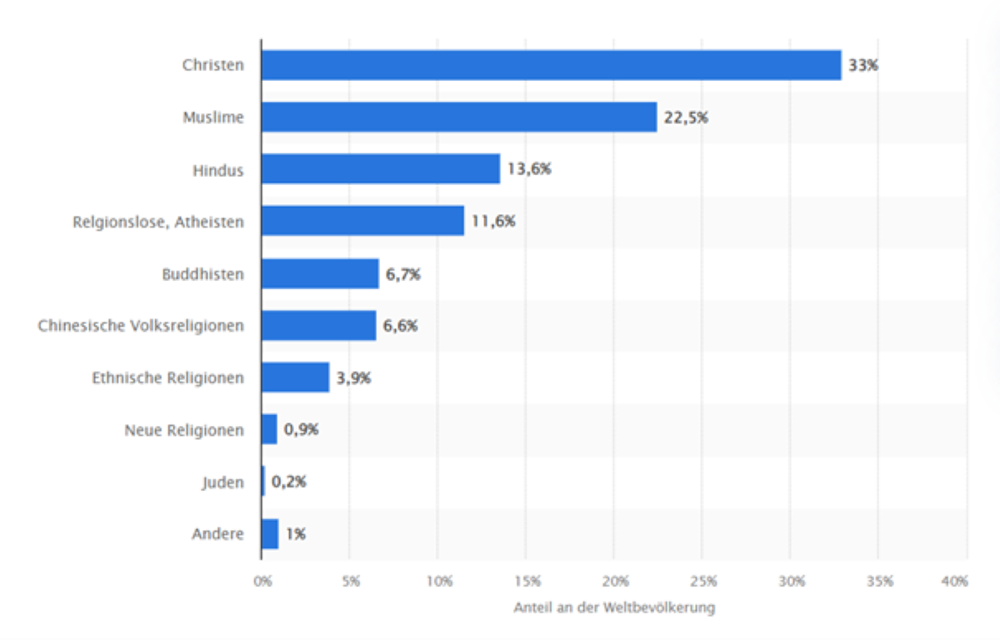

+++
title = "Ist der Glaube noch Wichtig?"
date = "2024-06-05"
draft = false
pinned = false
tags = ["Deutsch", "Reportage"]
image = "reportage_bild.jpg"
description = "Einige Religionen gibt es schon seit tausenden von Jahren, und überall auf der Welt.  Obwohl der Glaube einen grossen Einfluss auf die Geschichte hatte, scheint er für manche heute weniger Wichtigkeit zu tragen. Daher stellt sich die Frage: Wie wichtig ist der Glaube eigentlich noch?"
footnotes = "\n\n**Literaturverzeichnis  und Quellenangabe:** \n\nInterview mit Heinz Wulf, Matthias Kuhl und Azziya Anwar\n\n*https://www.bfs.admin.ch/bfs/de/home/statistiken/bevoelkerung/sprachen-religionen/religionen.html*\n\n*https://de.statista.com/statistik/daten/studie/256874/umfrage/anteil-der-anhaenger-ausgewaehlter-religionen-an-der-bevoelkerung-weltweit/*\n\n*https://kirchenvisite.ch/kirche/295-wohlen-bei-bern-kirche-wohlen-bei-bern*\n\n*https://www.amnesty.ch/de/ueber-amnesty/publikationen/magazin-amnesty/2006-2/auch-der-islam-wird-missbraucht*\n\n*https://www.dawn.com/news/1548550*"
+++
# **Ist der Glaube noch wichtig?**

Wie der Glaube den Menschen beeinflusst, und wieso er noch wichtig ist

*Text: Stefan Czupalla, Lucio Kälin*

##### Wofür Glauben?

Es ist der letzte Dienstag im März 2024. Direkt vom Gymnasium Kirchenfeld machen wir uns auf den Weg nach Wohlen, wo wir uns mit Heinz Wulf, dem Pfarrer der Kirchgemeinde Wohlen bei Bern, treffen. Nach einer Viertelstunde hält das Postauto an der Haltestelle Wohlen b. Bern, Gemeindehaus. Schon von hier sieht man die Kirche, welche den Anblick des Dorfes schon seit dem Jahre 1678 prägt. Von der Bushaltestelle aus sind wir nur noch wenige Schritte vom Kirchgemeindehaus entfernt. Nach kurzem Warten begrüsst uns Heinz Wulf und führt uns zum Pfarrhaus, wo wir unser Gespräch beginnen.

Er betont, dass ohne den Glauben und die Religion etwas Wichtiges fehlen würde. Über die Kirchen, die es in den meisten Dörfern der Schweiz gibt, bis hin zu den Feiertagen, an denen sich Familien zusammenfinden und sich mit Verwandten austauschen, sind auch heute noch wichtig. Hans Küng fragt sich in seinem Sachbuch: „Was Bleibt: Kerngedanken“, wie eine Welt ohne den Glauben und den damit zusammenhängenden Praktiken aussehen würde. 


Hans Küng (19.03.1928 - 06.04.2021) war ein Theologe und Author. Er war ein bekannter Kirchenkritiker, so lehnte beispielsweise das Dogma der Unfehlbarkeit des Papstes ab.


Schliesslich gibt es den Glauben schon seit tausenden von Jahren und man findet ihn fast überall auf der Welt. Es gibt sehr viele unterschiedliche Glaubensrichtungen, die sich alle voneinander unterscheiden. Trotz der vielen Verschiedenheiten suchen alle Glaubensrichtungen eine Antwort auf Fragen wie: „Wieso existiert die Welt und der Mensch?“, oder: „Was passiert nach dem Tod?“. Solche Fragen könnten ohne einen Glauben wohl nie geklärt werden. Ohne einen Glauben wäre der Tod, und was danach kommt gänzlich ungewiss. Ungewissheit kann für einige Leute eine starke Angst auslösen, die Todesangst ist ein gutes Beispiel dafür. Der Glaube gibt dem Tod einen Sinn, wandelt die Ungewissheit in eine Sicherheit um, und kann einem helfen die Angst vor dem Tod zu überwinden, und diesen zu akzeptieren. Zudem bewegt der Glaube den Gläubigen dazu, moralisch zu handeln und nicht nur für sich selbst zu sorgen. Deshalb kann der Glaube Gemeinschaften stärken, da kein Zusammenhalt möglich ist, wenn jeder nur für sich selbst agiert, und eine Gemeinschaft, in der jeder jedem bei Bedarf hilft, besser zusammenhalten kann. Der Glaube kann deshalb als Orientierung dienen, damit jemand ein besserer Mensch werden kann, wenn diese Person eine solche Orientierung benötigt. 

Heinz Wulf behauptet: *„Zu glauben gibt ja eigentlich keine objektive Antwort, ob es Gott gibt oder nicht. Aber manchen Menschen kann es helfen aus einer Krise herauszufinden oder ein besserer Mensch zu werden, weil man sich an Gott orientieren kann. Ich kenne aber auch durchaus Menschen, die das auch ganz gut können, ohne an Gott zu glauben.“.*

##### Sicht einer Religiösen Person

An einem warmen Freitag im April trafen wir uns während der Mittagspause mit Azziya Anwar, um sie über ihren Glauben zu befragen. Azziya erzählte das sie schon seit ihren jungen Jahren durch ihre Familie stark religiös beeinflusst wurde und aufgrund dieses Faktes jetzt mit grosser Überzeugung ihre Religion ausübt. Es interessierte uns wie Ihr Alltag aufgrund der Ausübung ihrer Religion beeinflusst wird, sie erläuterte uns: «Im Islam muss man 5-mal am Tag beten und was wir jetzt im Moment auch haben, ist der Ramadan, In dem wir vom Sonnenaufgang bis zum Sonnenuntergang fasten. Vor dem Beten müssen wir uns waschen. Dieses Ritual heisst bei uns Wudū und hat eine reinigende Wirkung.» Wir fragten uns, wie für sie das Beten in der Schule funktioniert. Sie erklärte das alle Schülerinnen und Schüler an der Schule, welche mittags beten wollen einen Badge ausleihen können, welcher ihnen Zutritt zu einem Raum gibt, in welchem sie während der Mittagspause in Ruhe beten können. Da wir uns sonst im Alltag nicht stark mit dem Islam befassen und es auch nicht ein Thema ist, das man im Unterricht bespricht, waren wir interessiert daran, wie der Gemeinschaftsaspekt dadurch beeinflusst wird. Sie sagte: « Wir beten tendenziell, weil wir sehr viel zu tun haben, oft alleine aber wenn man zum Beispiel in eine Moschee geht, kann man auch in einer Gesellschaft beten und es gibt wie einen Führer welcher das Gebet führt, und im Islam ist das immer ein Mann. Frauen können auch Gebete führen, jedoch nur unter Frauen.» Wir überlegten auch ob Ihre Religion zu ihren Freundschaften beiträgt, sie erläuterte, dass es in den Moscheen Gemeinschaften gibt, in welchen man die Gelegenheit hat neue Menschen kennenzulernen. Sie erzählte das sie aufgrund ihrer Herkunft einer Gemeinschaft angehört welche nur aus Leuten aus Indonesien besteht. Wir fragten sie auch ob es Aspekte gibt, welche Ihr in ihrem Glauben schwerfallen. Sie stellte fest das ihr nichts schwer fällt, weil sie sich seit der Kindheit an die verschiedenen Rituale gewöhnt hatte. Sie sagte auch das der Aspekt des Feierns, welcher in Europäischen Ländern gewöhnlich ist, eine Sache ist von welcher sie sich fernhaltet und da fragt sie sich manchmal ob sie etwas verpasst, jedoch kommt sie damit klar, weil für sie der Glauben erstrangig ist und sie ihn sehr hoch schätzt.

##### Gemeinschaften und Religion

Religion kann dabei helfen, den Zusammenhalt in einer Gemeinschaft zu stärken. Zum Beispiel treffen sich Familien oder sogar Großfamilien, um ein Religiöses Fest zusammen zu feiern, und können so ihre Kontakte erneuern und verstärken. Azziya sagte ebenfalls, dass sie manchmal auch mit anderen Mitgliedern ihrer Religionsgemeinschaft betet und dass dies den Zusammenhalt stärkt. Religion kann jedoch nicht nur zur Instandhaltung alter Beziehungen dienen, sondern sie kann auch helfen, neue Kontakte zu knüpfen. Matthias Kuhl als gelehrter Theologe und Lehrperson für Religionslehre am Gymnasium Kirchenfeld, vermutet, dass Religion für viele Zuwanderer eine Rolle spielt. So wählen Zuwanderer meist Orte, wo sie durch Nationalität oder Religion sich an eine lokale Gemeinschaft anschliessen können. Er ist aber auch der Meinung, dass die Religion nicht nur vereinen, sondern auch ausgrenzen kann. Wenn man beispielsweise behauptet ein Land sei hauptsächlich christlich geprägt, könnten sich Nicht-Christen ausgeschlossen fühlen. Eine Ausschließung kann aber auch innerhalb einer Religion erfolgen, denn die Ausübung einer Religion kann von Ort zu Ort sehr verschieden sein. Das bedeutet, dass jemand der die gleiche Religion hat wie eine bestimmte Gemeinschaft, andere Ansichten haben kann als die meisten Mitglieder der Gemeinschaft. Aufgrund solcher Unterschiede kann sich eine Person trotz gleicher Religion nicht richtig akzeptiert oder nicht verstanden fühlen. Es gibt zahlreiche religiöse Texte, welche von jedem Leser anders verstanden werden können. Azziya erwähnte ebenfalls, dass leider der Terrorismus von manchen Leuten mit dem Islam verbunden wird, dies ist jedoch nicht wahr, da die Taten der Menschen nicht durch ihre Religion gerechtfertigt werden können. Sie bezeugte das der Islam als Religion für den Frieden steht und weder Gewalt noch Terrorismus propagiert. Jedoch wird Religion leider von manchen als Mittel genutzt, um ungerechte Taten zu rechtfertigen, oder um Popularität zu gewinnen. 

Die meisten Menschen sind Anteil einer Weltreligion, der größte Anteil hat mit 33% das Christentum, an zweiter Stelle ist der Islam mit einem Anteil von 22,5% der Weltbevölkerung, der Hinduismus ist mit 13,6% auch sehr weit verbreitet. Ein leicht kleinerer Anteil der Weltbevölkerung übt keine Religion aus, so sind etwa 11,6 % der Bevölkerung nicht-religiös. Die Restlichen 19,3% bestehen aus anderen Religionen wie dem Buddhismus, dem Judentum oder auch die chinesische Volksreligionen. Aufgrund dieser grossen Verbreitung haben einige Religionen sehr starken Einfluss auf die Bevölkerung. Wenn in einem Land die Bevölkerung hauptsächlich einer Religion angehört, hat eine Person dieser Religion eine bessere Chance die Gunst der Mehrheit zu erlangen. Leider kann dieser starke Zusammenhalt in einer Religion schnell zum Extremismus werden, wodurch Religionsminderheiten mehr und mehr verdrängt werden. Dieses Problem gibt es momentan in Pakistan, wo der Islam als Mittel der Machterhaltung missbraucht wird. Es gibt Zwangskonversionen zum Islam, wohl um Widerstand zu unterdrücken und um die Macht des Regimes zu stärken. Dies ist nur eines von leider mehreren Beispielen davon, dass eine Religion, auch wenn sie für Frieden und Akzeptanz spricht, von bestimmten Parteien für ihren eigenen Nutzen missbraucht werden kann.

##### Religionslandschaft im Wandel

In der Schweiz nimmt momentan der Anteil der Bevölkerung, der in einer Religionsgemeinschaft ist, ab. Laut dem BfS (Bundesamt für Statistik) ist der Hauptbeweggrund der Glaubensverlust oder das Fehlen eines Glaubens von Beginn an. Ein weiterer wichtiger Beweggrund ist eine Dissonanz zwischen Stellungsnahmen einer Religionsgemeinschaft und der persönlichen Meinung. Einige Leute wollen sich von Religionen distanzieren, da sie oft auch mit negativem in Verbindung gebracht werden, wie im vorhin genannten Beispiel in Pakistan. Denn Laut dem BfS bezeichnen sich etwa ein Drittel der Personen ohne Religionszugehörigkeit als „eher oder sicher spirituell“, sie sind also noch gläubig, wollen jedoch nicht zu einer Religiösen Gemeinschaft gehören. Die Religionslandschaft verändert sich ständig, und es ist nicht möglich vorherzusagen in welche Richtung es gehen wird, ob sich der Glauben noch stärker individualisiert oder ob in der Zukunft wieder eine grössere Glaubensgemeinschaft gefragt ist. Doch man kann sich sicherlich fragen, wenn der Glauben wegfällt, und damit die Religionen die Jahrhunderte bis Jahrtausende der Geschichte prägten, was bleibt?